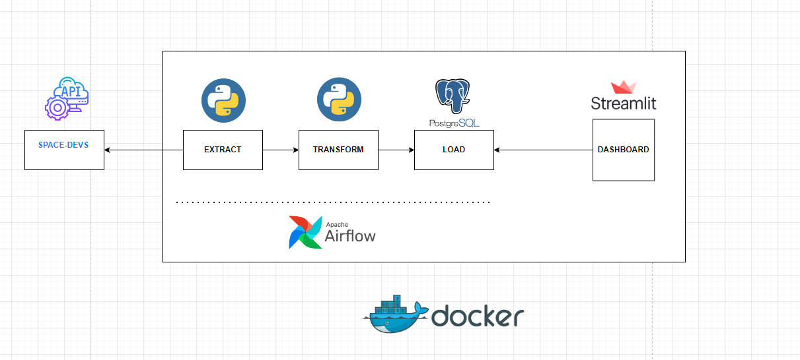
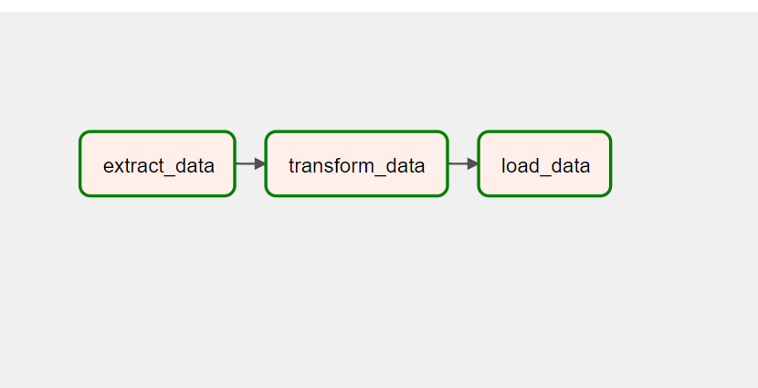
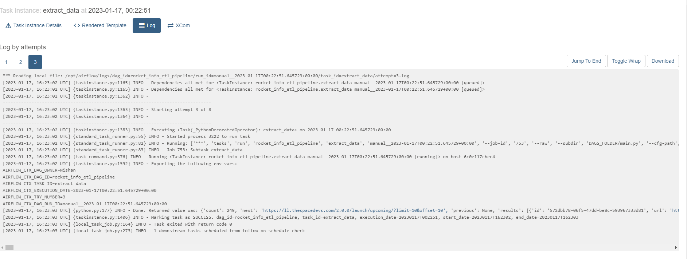
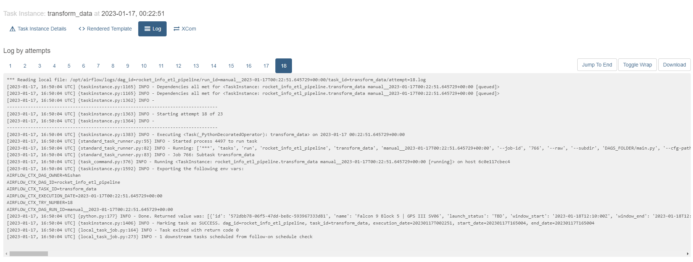
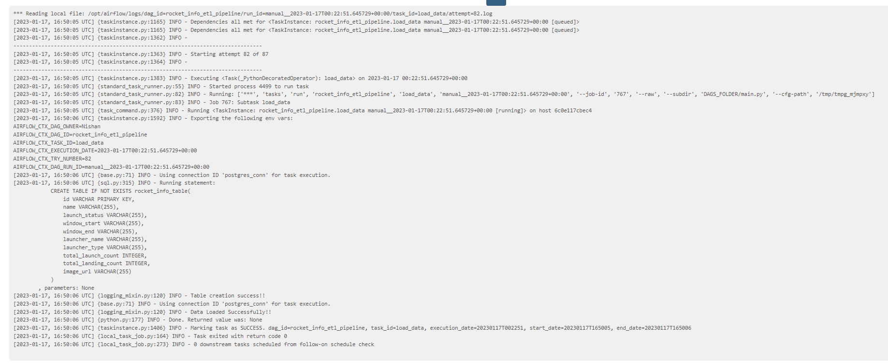
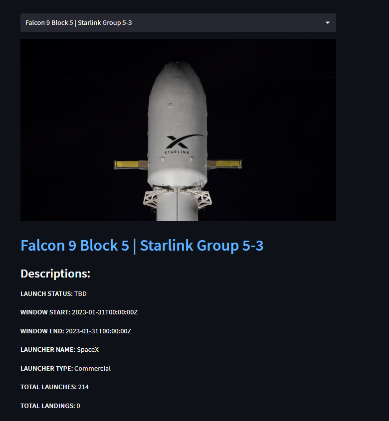

# Information About Recent/Upcoming Rocket Launches End-To-End ETL Data Pipeline




## Goal Of The Project:
Instead of going to the site and struggling to find the info about the recent/upcoming rocket launches, my idea was to present it on a dashboard, where we can click the name of the rocket and the dashboard will display all the related informations related to it.


## Table of Contents:
<ol>
    <li><a href="#about_the_data"> <b>About The Data </a></b></li>
    <li><a href="#used_steps_tools"><b>Used Steps & Tools</b>
        <ul>
        <li><a href="etl_workflow"><b> ETL Workflow </a></b></li>
        <li><a href="#extract"><b> Extract </a></b></li>
        <li><a href="#transform"><b> Transform </a> </b></li>
        <li><a href="#load"><b> Load </a> </b></li>
        <li><a href="#viz"><b> Visualization</a></b></li>
        <li><a href="#containerize"><b> Containerize Everything</a></b></li>
        </ul>
    </li>
    <li><a href="#conclusion"><b>Conclusion </a></b> </li>

</ol>

<h3 id ="about_the_data">1. About The Data:</h3>
The data used in this project has been extracted using an <a href="https://ll.thespacedevs.com/2.0.0/launch/upcoming/">API</a>. This data contains all the informations regarding recent/upcoming rocket launches. So, using this data we want to visualize all the informations related to a particular rocket in our Streamlit dashboard.

<h3 id="used_steps_tools">2. Used Steps & Tools:</h3>
    <ul>
        <li>
        <h4 id="etl_workflow">ETL Workflow</h4>
        
        So, in total, we have three different phases.
        Extract, transform and load, all of these tasks are orchestrated using Apache airflow and are built using Taskflow API.
        </li>
        <li>
        <h4 id="extract">Extract</h4>
        So, in this task, we make an API call, get the response as JSON and then send it to the transform task. <br>
        <br>
        <b> --- Log Data: ---</b>
        
        </li>
        <li>
        <h4 id="transform">Transform</h4>
        Once we get the JSON data, we only select the features that we need to store in our Postgres database so that later on we can pass these features to Streamlit and visualize. Once the features are extracted, it is passed to Load task as a list of dictionary, where each feature are presented as KEY and attributes as VALUE. <br>
        <br>
        <b> --- Log Data: ---</b>
          
        </li>
        <li>
        <h4 id="load">Load</h4>
        In this phase, we now have a clean data, now, we will create a table and insert the data into it using Postgres Hook. <br>
        <br>
        <b> --- Log Data: ---</b>
        
        </li>
        <li>
        <h4 id="viz">Visualization</h4>
        So, for the visualization, we connect to Postgres DB, get all the informations, list the names of the rocket as dropdown menu, so whenever we choose a name, all the informations related to it will be displayed. <br>
        <br>
        <b>  --- Demo: --- </b>
        
        </li>
        <li>
        <h4 id="containerize"> Containerize Everything </h4>
        So, finally after testing all the parts of the data pipeline, all the sections, Airflow, Postgres and Streamlit has been containerized in a single docker-compose.yaml file.
        So, Airflow works in <b>Port:8080</b>, Postgres works in <b>Port:5432</b> and Streamlit works in <b>Port:8501</b>.
        </li>
    </ul>


<h3 id="conclusion"> 3.Conclusion </h3>
Thus after going through all the task in the pipeline, finally we are able to get the proper information of the rocket we are interested, in this dashboard.

##### To run this app on you local machine, please locate the path of docker-compose.yaml and from their right click your mouse, click on Open in terminal and run:

```bash
  docker compose -f docker-compose.yaml up
```

##### NOTE: Make sure you have Docker installed on your machine.


